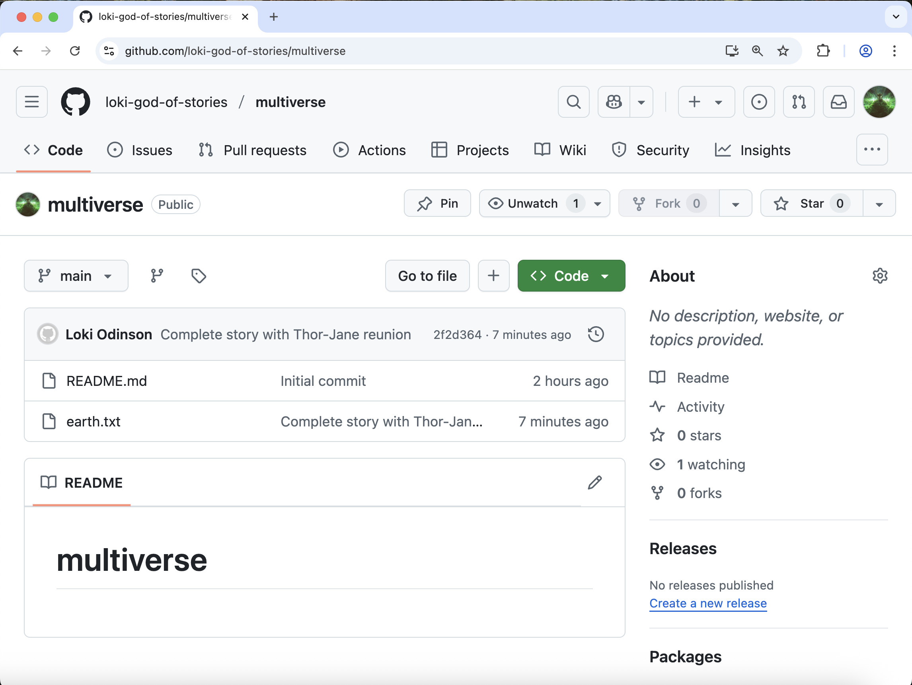
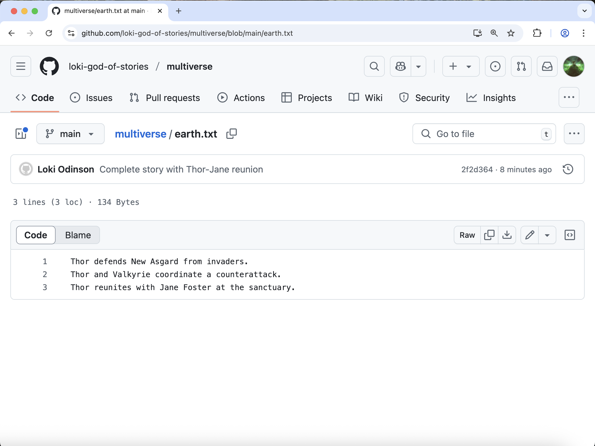
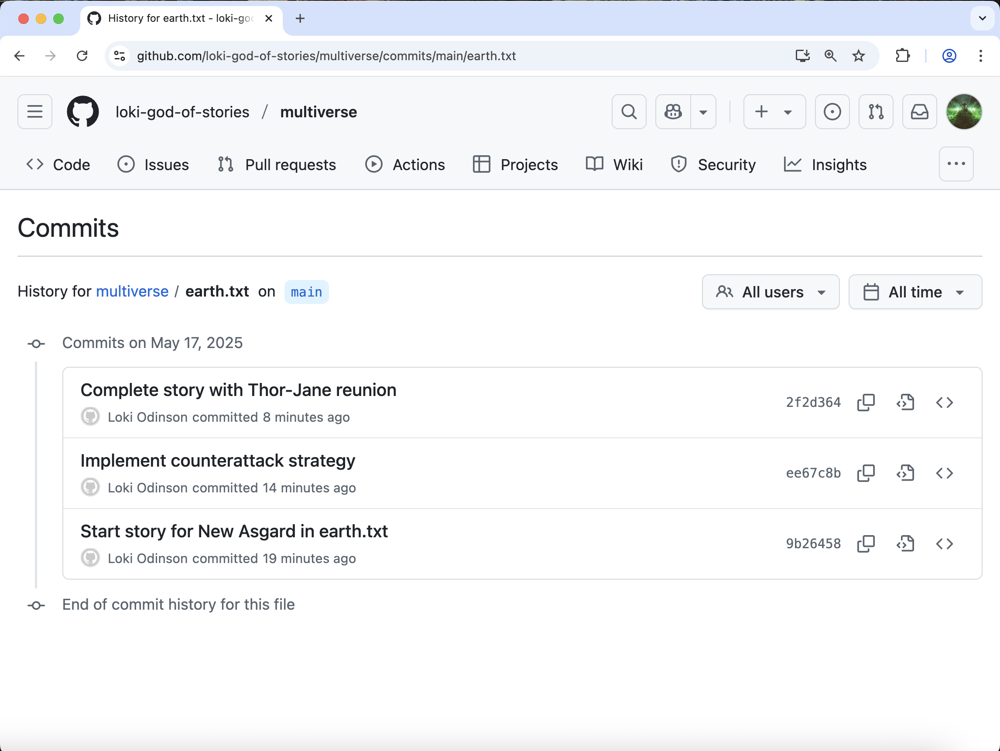

:::::::::::::::::::::::::::::::::::::: questions 

- How do I share my changes with others on the web?

::::::::::::::::::::::::::::::::::::::::::::::::

::::::::::::::::::::::::::::::::::::: objectives

- Push to or pull from a remote repository.

::::::::::::::::::::::::::::::::::::::::::::::::

## Local vs Remote Repositories

Version control really comes into its own when we begin to collaborate with
other people.  We already have most of the machinery we need to do this; the
only thing missing is to copy changes from one repository to another.

Systems like Git allow us to move work between any two repositories.  In
practice, though, it's easiest to use one copy as a central hub, and to keep it
on the web rather than on someone's laptop.  Most programmers use hosting
services like [GitHub](https://github.com), [Bitbucket](https://bitbucket.org) or
[GitLab](https://gitlab.com/) to hold those main copies; we're using GitHub.

Before we share our changes, let's first look at our `multiverse` repo on GitHub.

Even though we have made changes to our local copy of `multiverse`, the remote copy on GitHub still only has the README file. This is because we have not yet "pushed" our changes (or commits) to the remote repository.

::::::::::::::::::: callout

Note that our local repository still contains our earlier work on `earth.txt`, but the
remote repository on GitHub only contains the README file.

Because we created our repo on GitHub first and then cloned it to our local computer, the two repositories are already connected. If we had instead created the local repo first, then the remote repo on GitHub, we would need to manually connect the two repos, with a commmand like:

```bash
$ git remote add origin git@github.com:loki-god-of-stories/multiverse.git
```

`origin` is a local name used to refer to the remote repository. It could be called
anything, but `origin` is a convention that is often used by default in git
and GitHub, so it's helpful to stick with this unless there's a reason not to.

Instead, we can simply verify that the two repositories are connected with the command:

```bash
$ git remote -v
```

```output
origin  https://github.com/loki-god-of-stories/multiverse.git (fetch)
origin  https://github.com/loki-god-of-stories/multiverse.git (push)
```

:::::::::::::::::::::::::::

## Pushing local changes to GitHub

This command will push the changes from
our local repository to the repository on GitHub:

```bash
$ git push origin main
```

```output
Enumerating objects: 10, done.
Counting objects: 100% (10/10), done.
Delta compression using up to 8 threads
Compressing objects: 100% (8/8), done.
Writing objects: 100% (9/9), 992 bytes | 992.00 KiB/s, done.
Total 9 (delta 1), reused 0 (delta 0), pack-reused 0
remote: Resolving deltas: 100% (1/1), done.
To https://github.com/loki-god-of-stories/multiverse.git
   f537d84..2f2d364  main -> main
 ```

We can pull changes from the remote repository to the local one as well:

```bash
$ git pull origin main
```

```output
From https://github.com/loki-god-of-stories/multiverse
 * branch            main       -> FETCH_HEAD
Already up to date.
```

Pulling has no effect in this case because the two repositories are already
synchronized.  If someone else had pushed some changes to the repository on
GitHub, though, this command would download them to our local repository.

Let's verify that our changes made it to GitHub: go to your **browser window with the GitHub repo and refresh** the page. 



You should now see the `earth.txt` file. **Click on the file**, and you can see the contents of the file are the same as in VS Code.



Now **click on the "History" link**. You should see each commit made to the file, even though we only pushed once.




:::::::::::::::::::::::::::::::::::::::: keypoints

- A local Git repository can be connected to one or more remote repositories.
- `git push` copies changes from a local repository to a remote repository.
- `git pull` copies changes from a remote repository to a local repository.

::::::::::::::::::::::::::::::::::::::::::::::::::