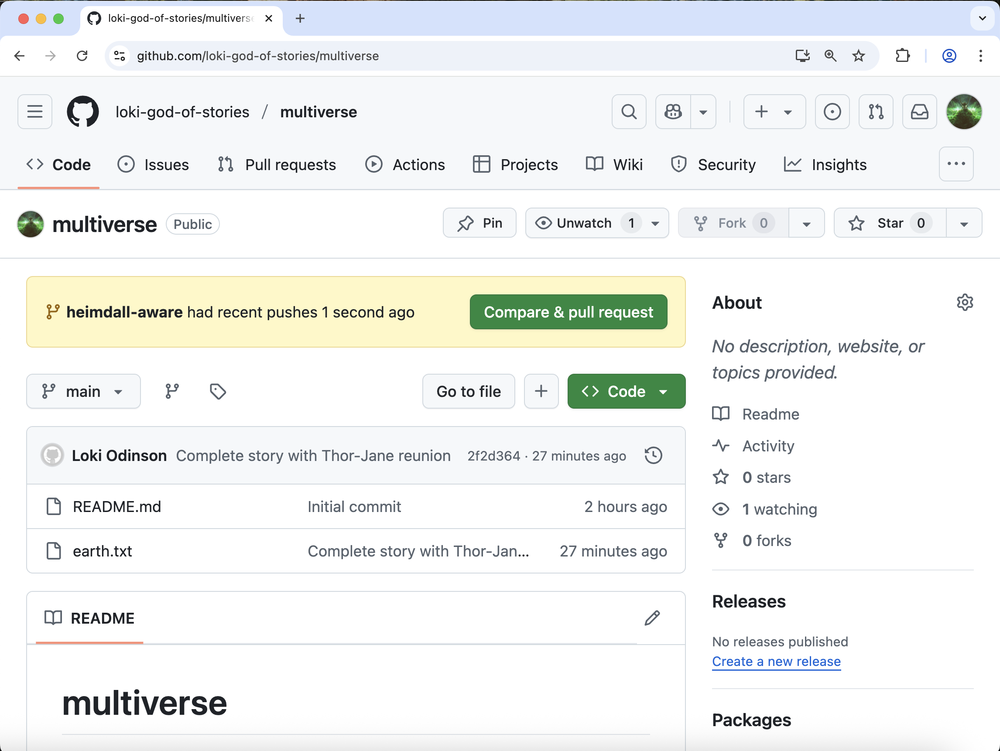

:::::::::::::::::::::::::::::::::::::: questions 

- What are branches?
- How can I work in parallel using branches?

::::::::::::::::::::::::::::::::::::::::::::::::

::::::::::::::::::::::::::::::::::::: objectives

- Understand why branches are useful for:
- *working on separate tasks in the same repository concurrently*
- *trying multiple solutions to a problem*
- *check-pointing versions of code*
- Merge branches back into the main branch

::::::::::::::::::::::::::::::::::::::::::::::::

So far we've always been working in a straight timeline.
However, there are times when we might want to keep
our main work safe from experimental changes we are working on.
To do this we can use branches to work on separate tasks in parallel
without changing our current branch, `main`.

We didn't see it before but the first branch made is called `main`.
This is the default branch created when initializing a repository and
is often considered to be the "clean" or "working" version of a
repository's code.

We can see what branches exist in a repository by typing

```bash
$ git branch
```

```output
* main
```

The '*' indicates which branch we are currently on.

In this lesson, Loki needs to track two possible branching timelines,
with two different versions of events happening on Asgard.
Only one of these timeline branches will become part of the "main" timeline.
In one timeline, Heimdall, guardian of the bifrost bridge, is aware of the invasion in New Asgard.
In another timeline, Heimdall is blinded by powerful magic and is unaware of any trouble in New Asgard.

First let's make the branch where Heimdall is aware.
We use the same `git branch` command but now add the 
name we want to give our new branch

```bash
$ git branch heimdall-aware
```

We can now check our work with the `git branch` command.

```bash
$ git branch
```

```output
  heimdall-aware
* main
```

We can see that we created the `heimdall-aware` branch but we
are still in the main branch.

We can also see this in the output of the `git status` command.

```bash
$ git status
```

```output
On branch main
nothing to commit, working directory clean
```

To switch to our new branch we can use the `checkout` command
we learned earlier and check our work with `git branch`.

```bash
$ git checkout heimdall-aware
$ git branch
```

```output
* heimdall-aware
  main
```

::::::::::::::::::::::: callout

We can use the `checkout` command to checkout a file from a specific commit
using commit hashes or `HEAD` and the filename (`git checkout HEAD <file>`). The
`checkout` command can also be used to checkout an entire previous version of the
repository, updating all files in the repository to match the state of a desired commit.

Branches allow us to do this using a human-readable name rather than memorizing
a commit hash. This name also typically gives purpose to the set of changes in
that branch. When we use the command `git checkout <branch_name>`, we are using
a nickname to checkout a version of the repository that matches the most recent
commit in that branch (a.k.a. the HEAD of that branch).

::::::::::::::::::::::::::

Here you can use `git log` and `ls` to see that the history and 
files are the same as our `main` branch. This will be true until
some changes are committed to our new branch.

```bash
$ git log --oneline
```

```output
2f2d364 (HEAD -> heimdall-aware, origin/main, origin/HEAD, main) Complete story with Thor-Jane reunion
ee67c8b Implement counterattack strategy
9b26458 Start story for New Asgard in earth.txt
f537d84 Initial commit
```

Now lets write what happens on Asgard.

Use the **"New file" button** to create a new file called `asgard.txt`.

Add one line to this file (and make sure to end with a newline), and then save it:

```output
Heimdall watches from afar, aware of New Asgard's plight.
```

Now we can add and commit the script to our branch.

```bash
$ git add asgard.txt
$ git commit -m "Create asgard.txt detailing Heimdall's awareness of invasion"
```

```output
[heimdall-aware daf95c3] Create asgard.txt detailing Heimdall's awareness of invasion
 1 file changed, 1 insertion(+)
 create mode 100644 asgard.txt
```

Lets check our work!

```bash
$ git log --oneline
```

```output
daf95c3 (HEAD -> heimdall-aware) Create asgard.txt detailing Heimdall's awareness of invasion
2f2d364 (origin/main, origin/HEAD, main) Complete story with Thor-Jane reunion
ee67c8b Implement counterattack strategy
9b26458 Start story for New Asgard in earth.txt
f537d84 Initial commit
```

As expected, we see our commit in the log.

Now let's switch back to the `main` branch.

```bash
$ git checkout main
$ git branch
```

```output
  heimdall-aware
* main
```

Let's explore the repository a bit.

Now that we've confirmed we are on the `main` branch again.
Let's confirm that `asgard.txt` and our last commit aren't in `main`.

```bash
$ git log --oneline
```

```output
2f2d364 (HEAD -> main, origin/main, origin/HEAD) Complete story with Thor-Jane reunion
ee67c8b Implement counterattack strategy
9b26458 Start story for New Asgard in earth.txt
f537d84 Initial commit
```

::::::::::::::::::::::::::::: callout
We no longer see the file `asgard.txt` and our latest commit doesn't
appear in this branch's history. But do not fear! All of our hard work
remains in the `heimdall-aware` branch. We can confirm this by moving back
to that branch.

```bash
$ git checkout heimdall-aware
$ git branch
```

```output
* heimdall-aware
  main
```

```bash
$ git log --oneline
```

And we see that our `asgard.txt` file and respective commit have been
preserved in the `heimdall-aware` branch.

Checkout the `main` branch again to prepare for creating another new 
branch based on the version history in main. New branches will
include the entire history up to the current commit, and we'd like
to keep these two tasks separate.

```bash
$ git checkout main
$ git branch
```

```output
  heimdall-aware
* main
```

:::::::::::::::::::::::::::::::::

Now we can keep track of a different timeline branching off from the main timeline.

This time let's create and switch to the `heimdall-blind` branch
in one command.

We can do so by adding the `-b` flag to checkout.

```bash
$ git checkout -b heimdall-blind
$ git branch
```

```output
  heimdall-aware
* heimdall-blind
  main
```

We can use `git log` to see that this branch is 
the same as our current `main` branch.

```bash
$ git log --oneline
```

```output
2f2d364 (HEAD -> heimdall-blind, origin/main, origin/HEAD, main) Complete story with Thor-Jane reunion
ee67c8b Implement counterattack strategy
9b26458 Start story for New Asgard in earth.txt
f537d84 Initial commit
```

Now we can a file for Asgard again and write the different version of events.
This time, let's make a markdown file instead of a text file.

Use the **"New File" button** to create a new file called `asgard.md` and add this line:

```
Heimdall's vision is blocked by *ancient magic*, unaware of New Asgard's danger.
```

```bash
$ git add asgard.md
$ git commit -m "Create asgard.md describing Heimdall's blocked vision"
```

```output
[heimdall-blind 59b9bab] Create asgard.md describing Heimdall's blocked vision
 1 file changed, 1 insertion(+)
 create mode 100644 asgard.md
```

Lets check our work again before we switch back to the main branch.

```bash
$ git log --oneline
```

```output
59b9bab (HEAD -> heimdall-blind) Create asgard.md describing Heimdall's blocked vision
2f2d364 (origin/main, origin/HEAD, main) Complete story with Thor-Jane reunion
ee67c8b Implement counterattack strategy
9b26458 Start story for New Asgard in earth.txt
f537d84 Initial commit
```

Loki decides the version of events where Heimdall is aware should be part of the main timeline.

We will merge the `heimdall-aware` branch into our `main` branch via a Pull Request so we can use it for our work going forward.

Before we can create a Pull Request on GitHub, we need to push this branch to the remote repo

Let's checkout & push the heimdall-aware branch:

```bash
$ git checkout heimdall-aware
$ git push
```

Whoops, we got an error:

```output
fatal: The current branch heimdall-aware has no upstream branch.
To push the current branch and set the remote as upstream, use

    git push --set-upstream origin heimdall-aware

To have this happen automatically for branches without a tracking
upstream, see 'push.autoSetupRemote' in 'git help config'.
```

While our main branch was already on both our local and remote repositories, our heimdall-aware branch is only on our local computer. You can check this by going to GitHub and searching for the heimdall-aware branch - you won't find it!

We need to use the `-u` flag in our command and specify the destination branch.

```bash
$ git push -u origin heimdall-aware
```

```output
Enumerating objects: 4, done.
Counting objects: 100% (4/4), done.
Delta compression using up to 8 threads
Compressing objects: 100% (3/3), done.
Writing objects: 100% (3/3), 406 bytes | 406.00 KiB/s, done.
Total 3 (delta 0), reused 0 (delta 0), pack-reused 0
remote: 
remote: Create a pull request for 'heimdall-aware' on GitHub by visiting:
remote:      https://github.com/loki-god-of-stories/multiverse/pull/new/heimdall-aware
remote: 
To https://github.com/loki-god-of-stories/multiverse.git
 * [new branch]      heimdall-aware -> heimdall-aware
branch 'heimdall-aware' set up to track 'origin/heimdall-aware'.
```

::::::::::::::::::: callout
## The '-u' Flag

You may see a `-u` option used with `git push` in some documentation.  This
option is synonymous with the `--set-upstream-to` option for the `git branch`
command, and is used to associate the current branch with a remote branch so
that the `git pull` command can be used without any arguments. To do this,
simply use `git push -u origin <branch-name>`.

::::::::::::::::::::::::

Now, we can go back to GitHub and verify that we have a new branch named heimdall-aware.



:::::::::::::::::::::::::::::::::::::::: keypoints

- Branches can be useful for developing while keeping the main line static.

::::::::::::::::::::::::::::::::::::::::::::::::::