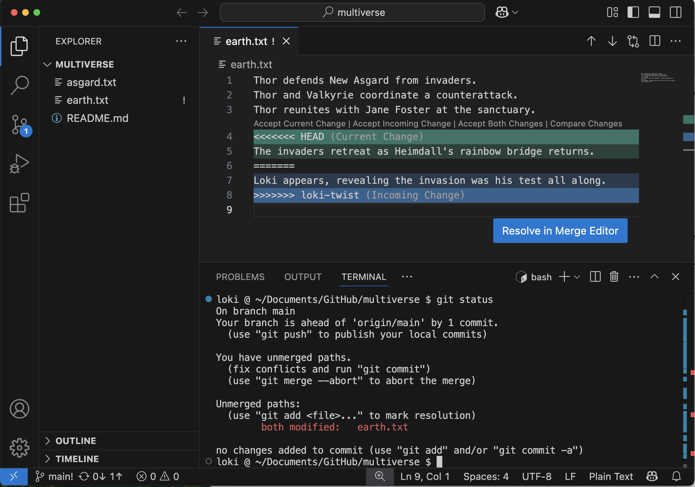
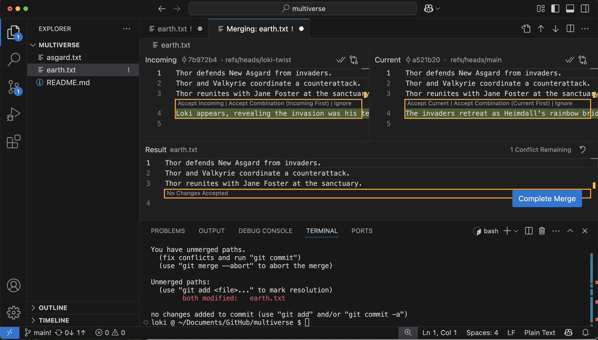
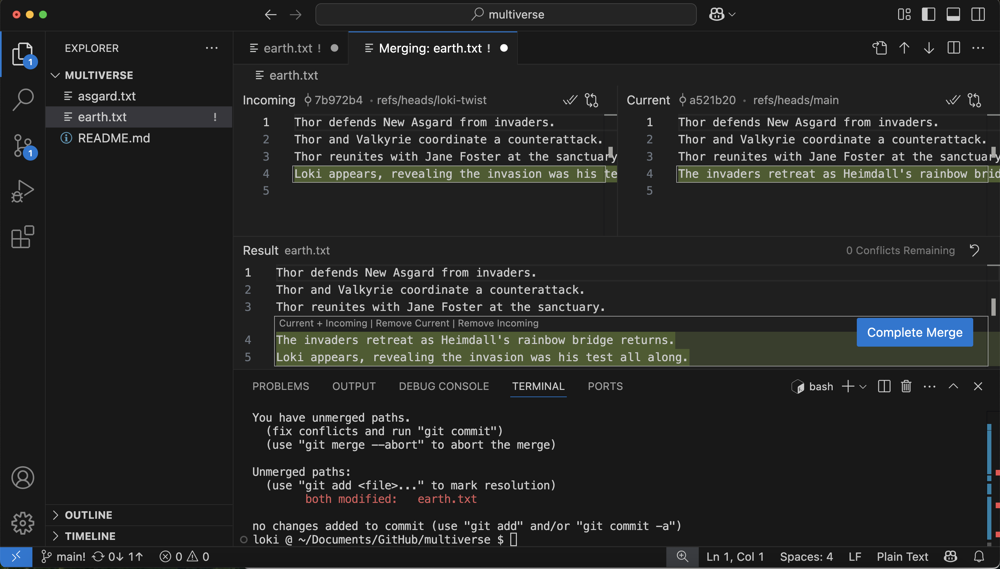

:::::::::::::::::::::::::::::::::::::: questions 

- What do I do when my changes conflict?

::::::::::::::::::::::::::::::::::::::::::::::::

::::::::::::::::::::::::::::::::::::: objectives

- Explain what conflicts are and when they can occur.
- Understand how to resolve conflicts resulting from a merge.

::::::::::::::::::::::::::::::::::::::::::::::::


As soon as people can work in parallel, they'll likely step on each other's
toes.  This will even happen with a single person: if we are working on
a piece of software on two different computers, we could make
different changes to each copy.  Version control helps us manage these
conflicts by giving us tools to resolve overlapping changes.

To see how we can resolve conflicts, we must first create one.  The
file `earth.txt` currently looks like this in our `multiverse` repository:

```output
Thor defends New Asgard from invaders.
Thor and Valkyrie coordinate a counterattack.
Thor reunites with Jane Foster at the sanctuary.

```

Let's create a new branch to describe 1 possible version of events to occur next.

```bash
$ git branch loki-twist
```

But before we checkout the `loki-twist` branch and add the event where Loki enters the picture, let's add a line to `earth.txt` here in the `main` branch.

```output
Thor defends New Asgard from invaders.
Thor and Valkyrie coordinate a counterattack.
Thor reunites with Jane Foster at the sanctuary.
The invaders retreat as Heimdall's rainbow bridge returns.

```

and commit that change to the `main` branch

```bash
$ git add earth.txt
$ git commit -m "Add invaders retreat"
```

```output
[main a521b20] Add invaders retreat
 1 file changed, 1 insertion(+)
```

We can then examine the commit history of the `main` branch.

```bash
$ git log --oneline
```

```output
a521b20 (HEAD -> main) Add invaders retreat
976b48e (origin/main, origin/HEAD) Merge pull request #1 from loki-god-of-stories/heimdall-aware
daf95c3 (origin/heimdall-aware) Create asgard.txt detailing Heimdall's awareness of invasion
2f2d364 Complete story with Thor-Jane reunion
ee67c8b Implement counterattack strategy
9b26458 Start story for New Asgard in earth.txt
f537d84 Initial commit
```

Now that we've made our changes in the `main` branch, let's add an event to the `loki-twist` branch.

```bash
$ git checkout loki-twist
$ git branch
```

```output
* loki-twist
  main
```

Let's add a line in `earth.txt` with Loki's reveal. Note that when we open
this file the line we added about the invaders retreating will not be present as
that change is not part of this branch.

```output
Thor defends New Asgard from invaders.
Thor and Valkyrie coordinate a counterattack.
Thor reunites with Jane Foster at the sanctuary.
Loki appears, revealing the invasion was his test all along.

```

Now let's commit this change to the `loki-twist` branch

```bash
$ git add earth.txt
$ git commit -m "Add twist ending with Loki as mastermind"
```

```output
[loki-twist 7b972b4] Add twist ending with Loki as mastermind
 1 file changed, 1 insertion(+)
```

Again, we can look at the history of this branch.

```bash
$ git log --oneline
```

```output
7b972b4 (HEAD -> loki-twist) Add twist ending with Loki as mastermind
976b48e (origin/main, origin/HEAD) Merge pull request #1 from loki-god-of-stories/heimdall-aware
daf95c3 (origin/heimdall-aware) Create asgard.txt detailing Heimdall's awareness of invasion
2f2d364 Complete story with Thor-Jane reunion
ee67c8b Implement counterattack strategy
9b26458 Start story for New Asgard in earth.txt
f537d84 Initial commit
```

::::::::::::::: callout

Notice that the commit related to the invaders retreating is not present as it is part of
the `main` branch, not the `loki-twist` branch.

:::::::::::::::::::

Now that we've added Loki's big reveal, we can merge this branch into the `main` branch. 
We're going to do this merge in VS Code rather than through a Pull Request in GitHub this time.

First, let's checkout the `main` branch.

```bash
$ git checkout main
$ git branch
```

```output
  loki-twist
* main
```

And then merge the changes from `loki-twist` into our current branch, `main`.

```bash
$ git merge loki-twist
```

```output
Auto-merging earth.txt
CONFLICT (content): Merge conflict in earth.txt
Automatic merge failed; fix conflicts and then commit the result.
```

Review the status of the repository now that we've been told merging has resulted in a conflict.

```bash
$ git status
```

```output
On branch main
Your branch is ahead of 'origin/main' by 1 commit.
  (use "git push" to publish your local commits)

You have unmerged paths.
  (fix conflicts and run "git commit")
  (use "git merge --abort" to abort the merge)

Unmerged paths:
  (use "git add <file>..." to mark resolution)
        both modified:   earth.txt

no changes added to commit (use "git add" and/or "git commit -a")
```


Git detects that the changes made in one copy overlap with those made
in the other and stops us from trampling on our previous work. It also
marks that conflict in the affected file, `earth.txt`.



Our change — the one at the `HEAD` of the `main` branch — is preceded by `<<<<<<<`.
Git has then inserted `=======` as a separator between the conflicting changes
and marked the end of our commit from the `loki-twist` branch with `>>>>>>>`.
(The string of letters and digits after that marker
identifies the commit we made in the `loki-twist` branch.)

It is now up to us to edit this file and reconcile the changes.
We can do anything we want: keep the change made in the `main` branch, keep
the change made in the `loki-twist` branch, write something new to replace both,
or get rid of the change entirely.

Let's keep both of these events, but save Loki's reveal for after the invaders reatreat.

VS Code will prompt you to "Resolve in Merge Editor". Click this button.



In the Merge Editor, you will see the two versions side by side, and the final version of the file below. We want the final version to look like:

```output
Thor defends New Asgard from invaders.
Thor and Valkyrie coordinate a counterattack.
Thor reunites with Jane Foster at the sanctuary.
The invaders retreat as Heimdall's rainbow bridge returns.
Loki appears, revealing the invasion was his test all along.

```

So we want to click "Accept Combination (Current First)". You should now see the resolved version with both lines, the line from the `main` branch first. Click "Complete Merge".



By clicking "Complete Merge", you are doing the same thing as running the command `git add earth.txt`. If you open the Source Control pane, you should see `earth.txt` under "Staged Changes". You can then complete the commit using the VS Code UI or on the command line

```bash
$ git commit -m "Merge changes from loki-twist"
```

```output
[main c5c81b3] Merge changes from loki-twist
```

Take a look at the Source Control Graph window (in the lower portion of the Source Control pane) for a visual representation of the git log.

```
$ git log
```

```output
commit c5c81b35d7631b4aa9c7d71d06253c593cbaf644 (HEAD -> main)
Merge: a521b20 7b972b4
Author: Loki Odinson <loki.odinson@tva.org>
Date:   Sat May 17 21:36:55 2025 -0400

    Merge branch 'loki-twist'

commit 7b972b4d86972ddfbacac225c5c84c8b4a5609ff (loki-twist)
Author: Loki Odinson <loki.odinson@tva.org>
Date:   Sat May 17 21:27:20 2025 -0400

    Add twist ending with Loki as mastermind

commit a521b20ef97343b49b3b25717e485b360fcb8d64
Author: Loki Odinson <loki.odinson@tva.org>
Date:   Sat May 17 21:25:13 2025 -0400

    Add invaders retreat
```

## When conflicts resolve themselves

Let's make another change to the `loki-twist` branch:

```
$ git checkout loki-twist
```

Add another line to `earth.txt`:

```output
Thor defends New Asgard from invaders.
Thor and Valkyrie coordinate a counterattack.
Thor reunites with Jane Foster at the sanctuary.
Loki appears, revealing the invasion was his test all along.
Thor smiles, having known his brother's scheme from the beginning.

```

```bash
$ git add earth.txt
$ git commit -m "Add Thor's knowing reaction to Loki's scheme"
```

```output
[loki-twist 959f09c] Add Thor's knowing reaction to Loki's scheme
 1 file changed, 1 insertion(+)
```

And merge that change into main branch

```bash
$ git checkout main
$ git merge loki-twist
```

```output
Updating c5c81b3..959f09c
Fast-forward
 earth.txt | 1 +
 1 file changed, 1 insertions(+), 0 deletions(-)
```

Git keeps track of what we've merged with what,
so we don't have to fix things by hand again.
There is no conflict and our changes are added automatically.

Finally, let's update our remote repository:

```bash
$ git push
```

::::::::::::::::::: callout
## Still seeing a conflict?

This exercise is dependent on how the merge conflict was resolved
in our first merge of the loki-twist branch and may still result
in a conflict when merging additional commits from the loki-twist branch.

::::::::::::::::::::::::::

```output
Thor defends New Asgard from invaders.
Thor and Valkyrie coordinate a counterattack.
Thor reunites with Jane Foster at the sanctuary.
The invaders retreat as Heimdall's rainbow bridge returns.
Loki appears, revealing the invasion was his test all along.
Thor smiles, having known his brother's scheme from the beginning.

```

We don't need to merge again because Git knows someone has already done that.

Git's ability to resolve conflicts is very useful, but conflict resolution
costs time and effort, and can introduce errors if conflicts are not resolved
correctly. If you find yourself resolving a lot of conflicts in a project,
consider these technical approaches to reducing them:

- Pull from upstream more frequently, especially before starting new work
- Use topic branches to separate work, merging to main when complete
- Make smaller more atomic commits
- Where logically appropriate, break large files into smaller ones so that it is
  less likely that two authors will alter the same file simultaneously

Conflicts can also be minimized with project management strategies:

- Try breaking large files apart into smaller files so that it is less
  likely that you will be working in the same file at the same time
  in different branches
- Create branches focused on separable tasks so that your work won't overlap in files
- Clarify who is responsible for what areas with your collaborators
- Discuss what order tasks should be carried out in with your collaborators so
  that tasks that will change the same file won't be worked on at the same time


:::::::::::::::::::: challenge

## Practice resolving conflicts with a partner

You can repeat this exercise twice, once in your `multiverse` repo, and once in your partner's.

You will first need to clone your partner's `multiverse` repo in order to make edits in it.

You will each create a new branch in the same `multiverse` repo, and make a small conflicting change (e.g. adding two different lines to the end of `earth.txt`). 

The repo owner should then create a Pull Request and merge their branch first.

The other person should then create a Pull Request to merge their branch. They will get a merge conflict. 

In VS Code, they can merge main into their branch and resolve the conflict, then push the commit with the resolved merge to GitHub. They should now be able to merge their branch into main as well.

::::::::::::::::::::::::::::::::

:::::::::::::::::::::::::::::::::::::::: keypoints

- Conflicts occur when files are changed in the same place in two commits that are being merged.
- The version control system does not allow one to overwrite changes blindly during a merge, but highlights conflicts so that they can be resolved.

::::::::::::::::::::::::::::::::::::::::::::::::::