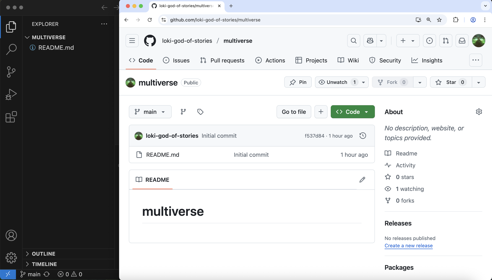

:::::::::::::::::::::::::::::::::::::: questions 

- What software do I need to have installed?
- Do I have a GitHub account?

::::::::::::::::::::::::::::::::::::::::::::::::

::::::::::::::::::::::::::::::::::::: objectives

- Install VS Code and other needed software
- Connect VS Code to GitHub

::::::::::::::::::::::::::::::::::::::::::::::::

::::::::::::::::::::::::::::::::::::: callout

If you are participating in this workshop remotely (e.g. over Zoom), it is highly recommended that you use two screens: 1 screen with the remote meeting, to see the instructor sharing their screen, and 1 screen with your applications. You will need to have VS Code and a web browser open to GitHub.com in order to follow along.



:::::::::::::::::::::::::::::::::::::

## Create a GitHub account

If you do not already have a GitHub account, visit [github.com](https://github.com) to create one.

You can refer to [this doc page](https://docs.github.com/en/get-started/start-your-journey/creating-an-account-on-github) for further instructions about creating a GitHub account.

If you already have a GitHub account, please verify that you can sign in, and take note of the email(s) associated with the account.

It is strongly recommended that you set up 2FA for your GitHub account, and to use a password manager.

## Software Installations

### Visual Studio Code

[Download and install VS Code](https://code.visualstudio.com/download). 

If you are new to using VS Code, you can review this [Getting Started](https://code.visualstudio.com/docs/getstarted/getting-started) guide.

### Git

You must have Git installed on your local computer. Typically, Mac and Linux computers come pre-installed with git, while Windows users must install [GitBash](https://gitforwindows.org) (Git for Windows). However, you should verify that Git is installed on your computer.

You can verify git is installed by opening a command line application (e.g. Terminal) and typing: 

```bash
$ git version
```

If you see an error message stating git is an unknown command, you will need to install git.

If you do not already have git installed, you can refer to [this GitHub guide](https://github.com/git-guides/install-git) on installing git for any OS. 

### Bash

You should have a Bash terminal. If you are on a Windows, you will have a Bash terminal by virtue of installing Git for Windows (GitBash). If you are on a Mac or Linux, you will already have a Bash terminal. If you prefer, you can use a similar terminal like Zsh.

Rather than using a seperate command line application, you will be using the Terminal in VS Code. To learn more about using the Terminal in VS Code, refer to [these docs](https://code.visualstudio.com/docs/terminal/basics).

## Connect VS Code to GitHub

Please refer to [these instructions](https://code.visualstudio.com/docs/sourcecontrol/intro-to-git#_set-up-git-in-vs-code) to sign in to GitHub from VS Code.

Optionally, you can install the GitHub extension, and follow [these instructions](https://code.visualstudio.com/docs/sourcecontrol/github) to sign into GitHub.

:::::::::::::::::::::::::::::::::::::::: keypoints

- GitHub, VS Code, bash, and git are needed for this lesson

::::::::::::::::::::::::::::::::::::::::::::::::::