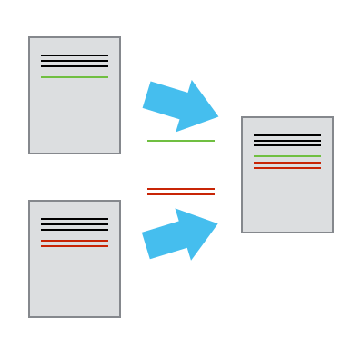

::::::::::::::::::::::::::::::::::::::: objectives

- recognize why version control is useful
- distinguish between Git and GitHub

::::::::::::::::::::::::::::::::::::::::::::::::::

:::::::::::::::::::::::::::::::::::::::: questions

- What is Git?
- What is GitHub?

::::::::::::::::::::::::::::::::::::::::::::::::::

:::::::::::::::::::::::::::::::::::::::::::::::::::::::::::::::::::: instructor

When the workshop begins, you should be sharing your screen,
and instruct the learners to make sure their setup looks like yours:

1. A new VS Code window is open (taking up the left 75% of the screen)
2. A browser window with GitHub is open (taking up the right 75% of the screen)

Instruct learners to sign in to GitHub if they have not already.

In your browser window, you can have a second tab open with all images for
this workshop, available at [this URL](http://jennajordan.me/git-novice-speedrun/instructor/images.html)

::::::::::::::::::::::::::::::::::::::::::::::::::::::::::::::::::::::::::::::::

## What is Version Control?

Version control is a name used for software which can help you record changes you make to the files in a directory on your computer. Version control software and tools (such as Git and Subversion/SVN) are often associated with software development, and increasingly, they are being used to collaborate in research and academic environments. Version control systems work best with plain text files such as documents or computer code, but modern version control systems can be used to track changes in most types of file.

At its most basic level, version control software helps us register and track sets of changes made to files on our computer. We can then reason about and share those changes with others. As we build up sets of changes over time, we begin to see some benefits.

### Benefits of using version control?

- **Collaboration** - Version control allows us to define formalized ways we can work together and share writing and code. For example merging together sets of changes from different parties enables co-creation of documents and software across distributed teams.
- **Versioning** - Having a robust and rigorous log of changes to a file, without renaming files (v1, v2, *final\_copy*)
- **Rolling Back** - Version control allows us to quickly undo a set of changes. This can be useful when new writing or new additions to code introduce problems.
- **Understanding** - Version control can help you understand how the code or writing came to be, who wrote or contributed particular parts, and who you might ask to help understand it better.
- **Backup** - While not meant to be a backup solution, using version control systems mean that your code and writing can be stored on multiple other computers.

There are many more reasons to use version control, and we'll explore some of these in the library context, but first let's learn a bit about a popular version control tool called Git.

"Piled Higher and Deeper" by Jorge Cham, http://www.phdcomics.com

## What are Git and GitHub?

We often hear the terms ***Git*** and ***GitHub*** used interchangeably but they are slightly different things.

***Git*** is one of the most widely used version control systems in the world. It is a free, open source tool that can be downloaded to your local machine and used for logging all changes made to a group of designated computer files (referred to as a "git repository" or "repo" for short) over time. It can be used to control file versions locally by you alone on your computer, but is perhaps most powerful when employed to coordinate simultaneous work on a group of files shared among distributed groups of people.

Rather than emailing documents with tracked changes and some comments and renaming different versions of files (example.txt, exampleV2.txt, exampleV3.txt) to differentiate them, we can use Git to save (or in Git parlance, "commit") all that information with the document itself. This makes it easy to get an overview of all changes made to a file over time by looking at a log of all the changes that have been made. And all earlier versions of each file still remain in their original form: they are not overwritten, should we ever wish to "roll back" to them.

Git was originally developed to help software developers work collaboratively on software projects, but it can be and is used for managing revisions to any file type on a computer system, including text documents and spreadsheets. Once installed, interaction with Git is done through the Command Prompt in Windows, or the Terminal on Mac/Linux. Since Word documents contain special formatting, Git unfortunately cannot version control those, nor can it version control PDFs, though both file types can be stored in Git repositories.

***GitHub*** on the other hand is a popular website for hosting and sharing Git repositories remotely. It offers a web interface and provides functionality and a mixture of both free and paid services for working with such repositories. The majority of the content that GitHub hosts is open source software, though increasingly it is being used for other projects such as open access journals (e.g. [Journal of Open Source Software](https://joss.theoj.org/)), blogs, and regularly updated text books.  In addition to GitHub, there are other Git hosting services that offer many similar features such as [GitLab](https://about.gitlab.com/), [Bitbucket](https://bitbucket.org/) and [Gitee](https://gitee.com/).

### Visualizing Git

Version control systems start with a base version of the document and
then save just the changes you made at each step of the way. You can
think of it as a tape: if you rewind the tape and start at the base
document, then you can play back each change and end up with your
latest version.

Once you think of changes as separate from the document itself, you
can then think about "playing back" different sets of changes onto the
base document and getting different versions of the document. For
example, two users can make independent sets of changes based on the
same document.

Unless there are conflicts, you can even play two sets of changes onto the same base document.

## Git terminology 

One of the main barriers to getting started with Git is understanding the terminology necessary to executing commands. Although some of the language used in Git aligns with common-use words in English, other terms are not so clear. The best way to learn Git terminology - which consists of a number of verbs such as add, commit and push (preceded by the word 'git') - is to use it, which is what we will be doing during this lesson. We will explain these commands as we proceed from setting up a new version-controlled project to publishing our own website.

On a command line interface, Git commands are written as `git verb options`,
where `verb` is what we actually want to do and `options` is additional optional information which may be needed for the `verb`.

:::::::::::::::::::::::::::::::::::::::: keypoints

- Version control helps track changes to files and projects
- Git and GitHub are not the same
- Git commands are written as `git verb options`

::::::::::::::::::::::::::::::::::::::::::::::::::

