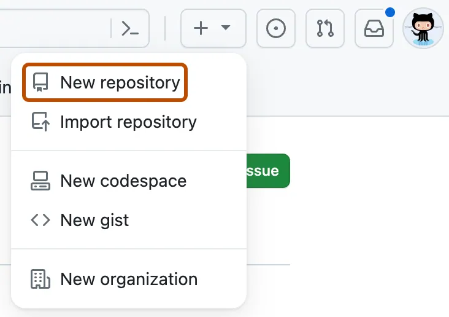

:::::::::::::::::::::::::::::::::::::: questions 

- How do I create a new repository on GitHub?
- How do I clone the repository to my local computer?

::::::::::::::::::::::::::::::::::::::::::::::::

::::::::::::::::::::::::::::::::::::: objectives

- Create `multiverse` repository on GitHub
- Clone the `multiverse` repository using VS Code

::::::::::::::::::::::::::::::::::::::::::::::::

:::::::::::::::::::::::::::::::::::::::::::::::::::::::::::::::::::: instructor

When the workshop begins, you should be sharing your screen,
and instruct the learners to make sure their setup looks like yours:

1. A new VS Code window is open (taking up the left 75% of the screen)
2. A browser window with GitHub is open (taking up the right 75% of the screen)

In your browser window, you can have a second tab open with all images for
this workshop, available at [this URL](http://jennajordan.me/git-novice-speedrun/instructor/images.html)

::::::::::::::::::::::::::::::::::::::::::::::::::::::::::::::::::::::::::::::::

## Create a new repo on GitHub

The first thing we need to do is create a new repository. While you can create repositories locally, and never even connect the local repo to a remote repo (hosted on a site like GitHub), the simplist and most common pattern to first create a new repo on GitHub, and then clone that repo to your local computer.

:::::::::::::::::::::::::::::::::::::::::::::::::::::::::::::::::::: instructor

The documentation for creating a new repo on GitHub is available [here](https://docs.github.com/en/repositories/creating-and-managing-repositories/creating-a-new-repository)

If you have taught this lesson before, make sure that you have deleted your existing `multiverse` repo.
The documentation for deleting a repo on GitHub is available [here](https://docs.github.com/en/repositories/creating-and-managing-repositories/deleting-a-repository)

::::::::::::::::::::::::::::::::::::::::::::::::::::::::::::::::::::

You should already be signed in to GitHub. You can create a new repo from anywhere on the site by clicking on the "+" icon in the upper right, and then clicking "New Repository":



Select your Github username as the "owner". 

Type `multiverse` for the repository name. 

Check the box next to "Add a README file".

Leave all other options as the default - your repo should be public, no gitignore selected, no license selected, and no template selected.


Finally, click the green "Create Repository" button at the bottom right.

You will be redirected to your newly created and empty `multiverse` repo.


## Clone your multiverse repo to your local computer

Now that the `multiverse` repo has been created, we can "clone" it (get a local copy of the repo) through the command line (or bash terminal).

Linux and Mac computers have "Terminal" applications. Windows computers need "Git Bash" installed. People refer to the terminal in various ways but they are all synonamous. All these terms refer to the same thing: terminal, bash, bash shell, bash terminal, console, the shell.

### Open a Bash Terminal

If you can't see the an icon for the terminal at the bottom of your screen you should be able to find it from the Menu button (on Linux), Start button (on Windows) or Apps button (on Mac).

The terminal usually opens up in your "home directory" or "home folder", indicated by a prompt which will be something along the lines of `/home/yourname$`, `/user/yourname$` or `~$`. These prompts are very configurable and might look different on different computers. The `$` is usually associated with the "Bash Shell" (there are many other shells) and the `~` is a shortcut for your home directory. You can always determine which directory you are in by typing `pwd` after the prompt and then pressing enter.

```bash
$ pwd
/home/yourname
```
We want to clone the `multiverse` repo into our home directory. When cloning, a new directory will be created, usually with the same name as the repository.

Navigate to the terminal that you opened and type at the prompt (replacing <yourgithub> with your GibHub account name:

```bash
git clone git@github.com:<yourgithub>/multiverse.git
```
Press enter to execute the command you just type. The following two line should be the resultant output.

```
Cloning into 'multiverse'...
warning: You appear to have cloned an empty repository.
```

You should now have your empty `multiverse` repo open, with a Bash terminal open, and you are ready to start typing your first git commands!


:::::::::::::::::::::::::::::::::::::::: keypoints

- Create a new repository on GitHub
- Clone the repository to your local computer
- Opening a bash terminal
::::::::::::::::::::::::::::::::::::::::::::::::::
