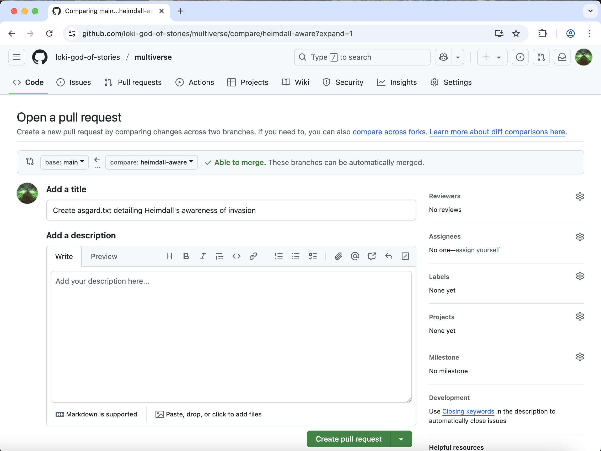
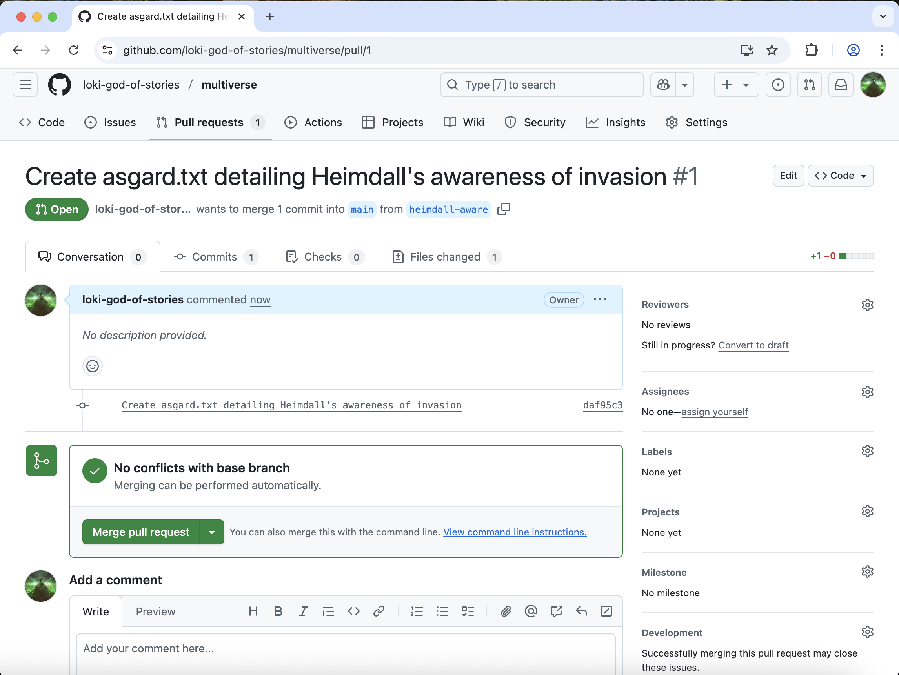

:::::::::::::::::::::::::::::::::::::: questions 

- What are pull requests for?
- How can I make a pull request?

::::::::::::::::::::::::::::::::::::::::::::::::

::::::::::::::::::::::::::::::::::::: objectives

- Define the terms fork, clone, origin, remote, upstream
- Understand how to make a pull request and what they are useful for

::::::::::::::::::::::::::::::::::::::::::::::::


:::::::::::::::: callout

Pull requests are a great way to collaborate with others using github.
Instead of making changes directly to a repository you can suggest changes to a repo.
This can be useful if you don't have permission to modify a repository directly or
you want someone else to review your changes.

:::::::::::::::::::::

On GitHub, in your `multiverse` repo, **click on the "Pull Requests" tab**. 

Then **click "New pull request"**. Alternatively, GitHub will see your new branch with recent changes and will prompt you to "Compare & pull request". Click this button to also be taken to the new pull request page.



Make sure that the "base" branch is `main` and the "compare" branch is `heimdall-aware`.

Next, we need to give our PR a title. By default, your PR will get the title from your last commit. We can leave this as is.

**Click "Create pull request"**.



Your `multiverse` repo should now have 1 pull request. This is the phase where you would normally request a reviewer, who can leave comments on your code. In repos that you do not own, your PR will need to be approved by a codeowner before you can merge it. Since you are the codeowner, we can go ahead and **click "Merge pull request"**. Confirm & complete the merge.

Go back to the "Code" tab and make sure you are on the "main" branch. You should now see an "asgard.txt" file.

Let's go **back to VS Code**. Checkout the main branch, and look at the files and history:

```bash
$ git checkout main
$ git log --oneline
```

```output
2f2d364 (HEAD -> main, origin/main, origin/HEAD) Complete story with Thor-Jane reunion
ee67c8b Implement counterattack strategy
9b26458 Start story for New Asgard in earth.txt
f537d84 Initial commit
```

The analysis file is not on "main" yet. This is because we need to first pull the changes we made with the Pull Request from the remote repository.

```bash
$ git pull
```

```output
remote: Enumerating objects: 1, done.
remote: Counting objects: 100% (1/1), done.
remote: Total 1 (delta 0), reused 0 (delta 0), pack-reused 0 (from 0)
Unpacking objects: 100% (1/1), 952 bytes | 476.00 KiB/s, done.
From https://github.com/loki-god-of-stories/multiverse
   2f2d364..976b48e  main       -> origin/main
Updating 2f2d364..976b48e
Fast-forward
 asgard.txt | 1 +
 1 file changed, 1 insertion(+)
 create mode 100644 asgard.txt
```

```
$ git log --oneline
```

```output
976b48e (HEAD -> main, origin/main, origin/HEAD) Merge pull request #1 from loki-god-of-stories/heimdall-aware
daf95c3 (origin/heimdall-aware, heimdall-aware) Create asgard.txt detailing Heimdall's awareness of invasion
2f2d364 Complete story with Thor-Jane reunion
ee67c8b Implement counterattack strategy
9b26458 Start story for New Asgard in earth.txt
f537d84 Initial commit
```

Now our main branch is up to date.

## Deleting branches

Now that we've merged the `heimdall-aware` into `main`, these changes
exist in both branches. This could be confusing in the future if we
stumble upon the `heimdall-aware` branch again.

We can delete our old branches so as to avoid this confusion later.
We can do so by adding the `-d` flag to the `git branch` command.

```bash
git branch -d heimdall-aware
```

```output
Deleted branch heimdall-aware (was daf95c3).
```

And because we don't want to keep the changes in the `heimdall-blind` branch,
we can delete the `heimdall-blind` branch as well

```bash
$ git branch -d heimdall-blind
```

```output
error: The branch 'heimdall-blind' is not fully merged.
If you are sure you want to delete it, run 'git branch -D heimdall-blind'.
```

Since we've never merged the changes from the `heimdall-blind` branch,
git warns us about deleting them and tells us to use the `-D` flag instead.

Since we really want to delete this branch we will go ahead and do so.

```bash
git branch -D heimdall-blind
```

```output
Deleted branch heimdall-blind (was 59b9bab).
```

Finally, we can also delete the heimdall-aware branch **on GitHub. Click on "Branches"**, and to delete the `heimdall-aware` branch **click the trashcan icon** to the right of the branch name.

:::::::::::::::::::::::::::::::::::::::: keypoints

- Pull requests suggest changes to repos where you don't have privileges

::::::::::::::::::::::::::::::::::::::::::::::::::